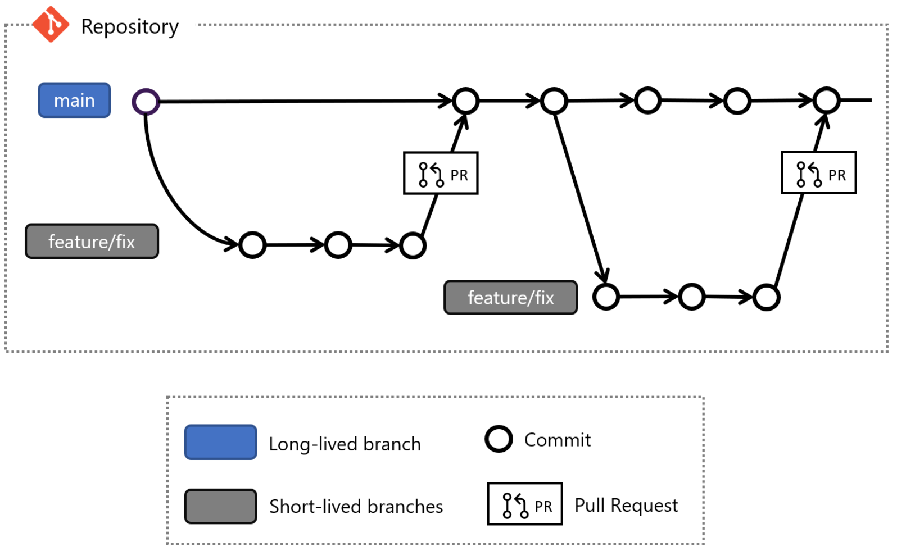

# Contributing

## Git Workflows

There are some development workflows current in usage in software development and the main go of having those is to minimize the conflicts during merging code.

Some references for Git Workflow:

1. [Bitbucket](https://www.atlassian.com/git/tutorials/comparing-workflows)
2. [GitLab](https://about.gitlab.com/topics/version-control/what-is-git-workflow/)
3. [Azure Devops](https://docs.microsoft.com/en-us/azure/devops/repos/git/git-branching-guidance?view=azure-devops)

## Git Feature Branch or Scaled Trunk workflow

For this project we are going to use this workflow where developers create a new short-lived branch based on the **main** branch and merge theirs changes by opening a PR (Pull Request).

>Be sure that you have the last changes on your local main before creating a new branch, to do that execute `git pull` on the main branch before creating a new branch

## Naming Conventions

### Features Branch

For even short-lived branch created to implement a feature/fix we are going to use the following

task/**`<Azure Devops work-item-ID>`**/**`<description>`**

### Commits

Having a good git history helps the reviewers to get context of the changes to help on that matter, we suggest use the following as a prefix for the git commit messages:

- docs: `<subject>`
- style: `<subject>`
- feat: `<subject>`
- fix: `<subject>`
- test: `<subject>`
- refactor: `<subject>`
- chore: `<subject>`
